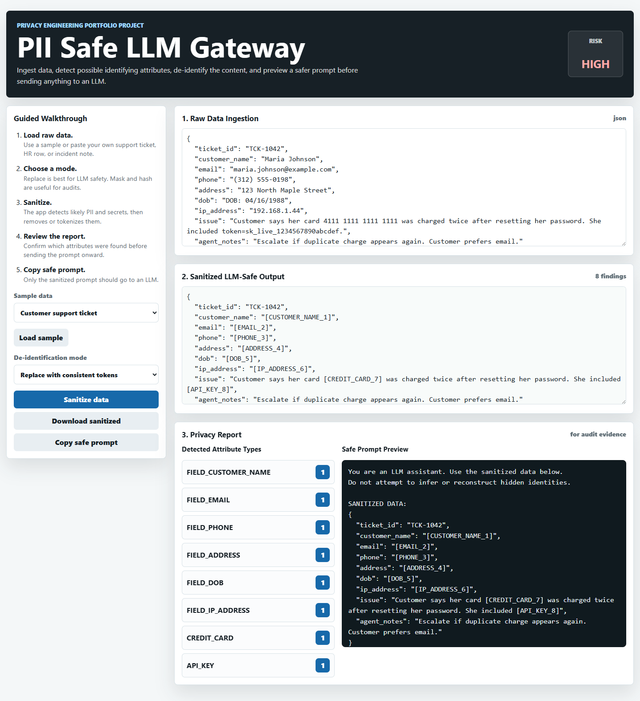
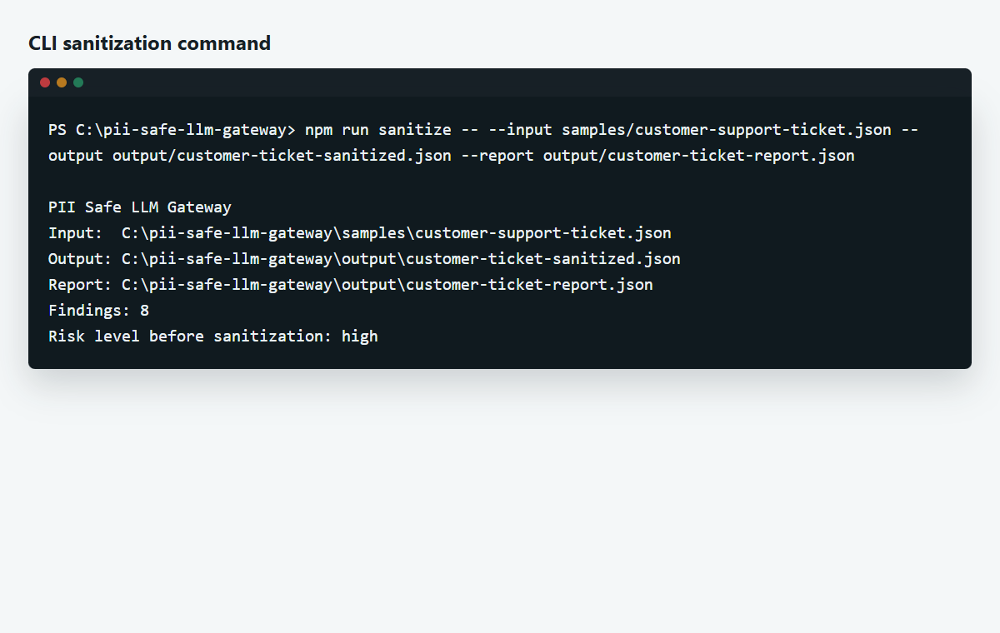

# PII Safe LLM Gateway

A beginner-friendly privacy engineering project that ingests raw data, detects possible identifying attributes, strips or tokenizes them, and produces a safer prompt preview before data is sent to a Large Language Model.

This project is built for a cybersecurity, privacy, data governance, or AI security portfolio. It shows recruiters that you understand a real business problem: teams want to use LLMs, but raw support tickets, HR files, logs, and incident notes often contain sensitive information.

## What This Project Demonstrates

- Data ingestion from text, JSON, and CSV
- PII and secret detection using deterministic rules
- De-identification with replace, mask, hash-like, or remove modes
- Audit-style privacy report
- Local browser demo for screenshots and walkthroughs
- Command-line interface for repeatable processing
- Tests that prove sensitive values are removed
- Beginner-ready documentation and GitHub upload steps

## Why This Matters

Before sending data to an LLM, organizations should reduce exposure of:

- Names
- Email addresses
- Phone numbers
- Street addresses
- SSNs
- Credit card numbers
- IP addresses
- Dates of birth
- Passwords, tokens, API keys, and secrets

This project acts like a lightweight local privacy gateway. It does not guarantee perfect anonymization, but it demonstrates the correct security mindset: inspect, sanitize, report, then send only the minimum necessary data.

## Project Screenshots

Screenshots are included in:

- `docs/images/01-home-dashboard.png`
- `docs/images/02-json-sanitized-output.png`
- `docs/images/03-csv-sanitized-output.png`
- `docs/images/04-cli-output.png`

### Browser Dashboard



### Sanitized JSON Output


### CLI Evidence



## Requirements

You only need Node.js 20 or newer.

Check whether Node is installed:

```powershell
node --version
```

If that command does not work, install Node.js LTS from:

```text
https://nodejs.org
```

## Quick Start

Open PowerShell and run:

```powershell
cd C:\path\to\pii-safe-llm-gateway
node --version
npm test
npm start
```

If `npm` is not available yet, use the direct Node commands:

```powershell
node tests/run-tests.js
node server.js
```

On this PC, you can also use:

```powershell
.\start-demo.ps1
```

Then open:

```text
http://127.0.0.1:5188
```

## CLI Example

Sanitize the sample customer support ticket:

```powershell
npm run sanitize -- --input samples/customer-support-ticket.json --output output/customer-ticket-sanitized.json --report output/customer-ticket-report.json
```

Direct Node version:

```powershell
node src/cli.js --input samples/customer-support-ticket.json --output output/customer-ticket-sanitized.json --report output/customer-ticket-report.json
```

Sanitize the sample HR CSV:

```powershell
npm run sanitize -- --input samples/hr-onboarding.csv --output output/hr-onboarding-sanitized.csv --report output/hr-onboarding-report.json
```

Sanitize incident notes and use mask mode:

```powershell
npm run sanitize -- --input samples/incident-notes.txt --output output/incident-notes-sanitized.txt --report output/incident-notes-report.json --mode mask
```

## De-identification Modes

| Mode | What It Does | Best Use |
| --- | --- | --- |
| `replace` | Replaces identifiers with consistent tokens like `[EMAIL_1]` | Best default for LLM prompts |
| `mask` | Keeps first and last characters but hides the middle | Good for human review |
| `hash` | Replaces values with stable hash-like labels | Good for audit correlation |
| `remove` | Removes detected values | Highest minimization |

## Example Before and After

Raw input:

```text
Customer Daniel Morris called from 555-884-1200.
His email is daniel.morris@example.com.
The login came from 203.0.113.25.
```

Sanitized output:

```text
Customer Daniel Morris called from [PHONE_1].
His email is [EMAIL_2].
The login came from [IP_ADDRESS_3].
```

## Important Limitation

This project is a portfolio-ready proof of concept, not a complete enterprise DLP product. Real production systems should combine deterministic rules, trained entity recognition models, human review, policy enforcement, logging, and legal/privacy review.

## Repository Structure

```text
pii-safe-llm-gateway/
  public/                 Browser demo
  samples/                Raw sample files with fake sensitive data
  src/                    Reusable de-identification engine and CLI
  tests/                  Automated tests
  docs/                   Walkthrough, architecture, commands, screenshots
  output/                 Generated sanitized files, ignored by Git
```

## How to Upload This to GitHub

From inside the project folder:

```powershell
git init
git add .
git commit -m "Add PII safe LLM gateway project"
git branch -M main
git remote add origin https://github.com/YOUR-USERNAME/pii-safe-llm-gateway.git
git push -u origin main
```

Replace `YOUR-USERNAME` with your GitHub username.

## Recruiter Summary

This project shows that I can build a practical AI security control that reduces sensitive-data exposure before LLM usage. It includes local ingestion, de-identification, audit reporting, tests, and a guided demo that explains privacy risk in a way non-technical stakeholders can understand.
