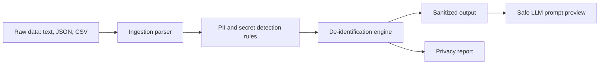

# Architecture

## Data Flow

## Components

| Component | File | Purpose |
| --- | --- | --- |
| De-identification engine | `src/deidentifier.js` | Detects and replaces possible sensitive attributes |
| CLI | `src/cli.js` | Runs sanitization from PowerShell |
| Browser demo | `public/index.html`, `public/app.js`, `public/styles.css` | Guided visual workflow |
| Samples | `samples/` | Fake but realistic input data |
| Tests | `tests/run-tests.js` | Proves sensitive values are removed |
| Docs | `docs/` | Walkthrough and recruiter explanation |

## Detection Strategy

The project uses deterministic rules for:

- Email addresses
- Phone numbers
- SSNs
- Credit cards with Luhn validation
- IP addresses
- Dates of birth
- Street addresses
- API keys, passwords, tokens, and secrets
- Sensitive field names in JSON/CSV such as `email`, `phone`, `address`, `dob`, and `api_key`

## Security Design Choices

1. Run locally first.
2. Sanitize before sending data to an LLM.
3. Create an audit report.
4. Use fake sample data for the public repository.
5. Do not store real sensitive data in GitHub.

## Future Improvements

- Add PDF and Word document parsing
- Add machine-learning named entity recognition
- Add policy profiles such as HIPAA, PCI, HR, and customer support
- Add allow/deny lists per organization
- Add approval workflow before LLM submission
- Add integration with local LLM tools such as Ollama
